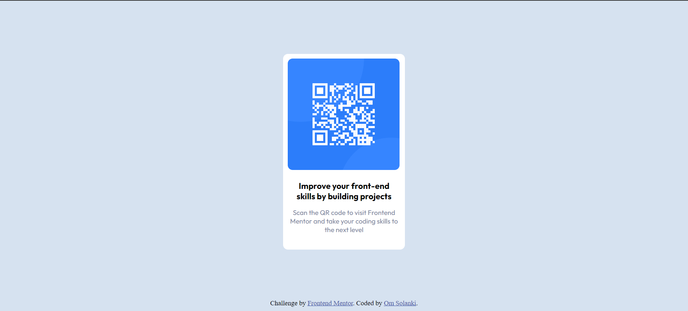

# Frontend Mentor - QR code component solution

This is a solution to the [QR code component challenge on Frontend Mentor](https://www.frontendmentor.io/challenges/qr-code-component-iux_sIO_H). Frontend Mentor challenges help you improve your coding skills by building realistic projects. 

## Table of contents

- [Overview](#overview)
  - [Screenshot](#screenshot)
  - [Links](#links)
- [My process](#my-process)
  - [Built with](#built-with)
  - [What I learned](#what-i-learned)
  - [Useful resources](#useful-resources)
- [Author](#author)
- [Acknowledgments](#acknowledgments)

**Note: Delete this note and update the table of contents based on what sections you keep.**

## Overview

### Screenshot



### Links

- Live Site URL: [Add live site URL here](https://your-live-site-url.com)

## My process

### Built with

- Semantic HTML5 markup
- CSS custom properties
- Flexbox

### What I learned

I learned how to make a layout using the flexbox property in CSS. I learned how to add semantics to the webpage using HTML and lots of other different things while
making this webpage.

To see how you can add code snippets, see below:

```html
<h1>Some HTML code I'm proud of</h1>
```
```css
.proud-of-this-css {
  color: papayawhip;
}
```
 
### Useful resources

- [MDN Web Docs]([https://www.example.com](https://developer.mozilla.org/en-US/docs/Web/CSS)) - This helped me in learning CSS. I usually use this resource for 
   learning different types of CSS properties.
- [W3Schools]([https://www.example.com](https://www.w3schools.com/html/)) - This is also an amazing site for learning. This site helped me in writing HTML codes.

## Author

- Name: Om Solanki
- Frontend Mentor - [@mnitrix](https://www.frontendmentor.io/profile/mnitrix)
- Email - [@omsolanki](mailto:oms54327@gmail.com)

## Acknowledgments

CodeHelp - by Babbar[https://www.youtube.com/@CodeHelp]
